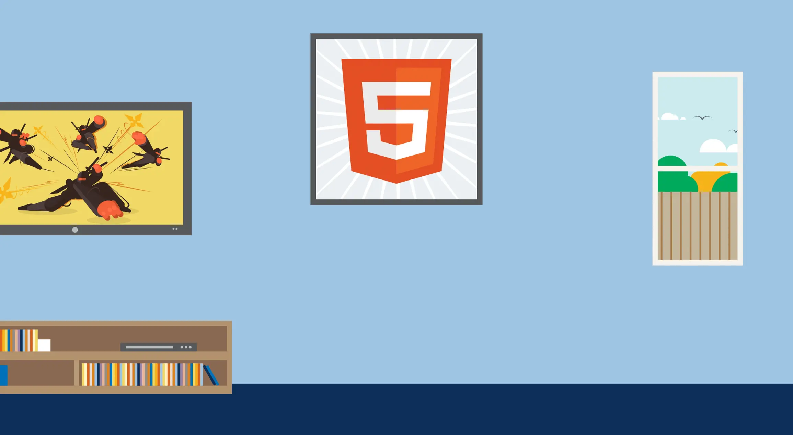

# Hello , my name is Felix👋

I'm a Climate Scientist and an aspiring Software Engineer and Data Scientist, i love to see how machines react with codes. I code in Python, CSS, HTML , Javascript and FORTRAN 90.
Currently working on *powerfile.org     , A website that host learning materials for students in Kwame Nkrumah University of Science and Technology- KNUST .
 
Currently managing relgh.com    , the first African deaf online learning platform .
 

 

## Happy Coding

 
  

  
   

  
## Let's connect  🌎:

- Learning with other Dev  on <a href="https://twitter.com/KwamenaFelix">Twitter</a> 👬

- Connecting on <a href="https://www.linkedin.com/in/awortwe-felix-kwamena-%F0%9F%87%AC%F0%9F%87%AD-4644a7140/">LinkedIn</a> 🕴 